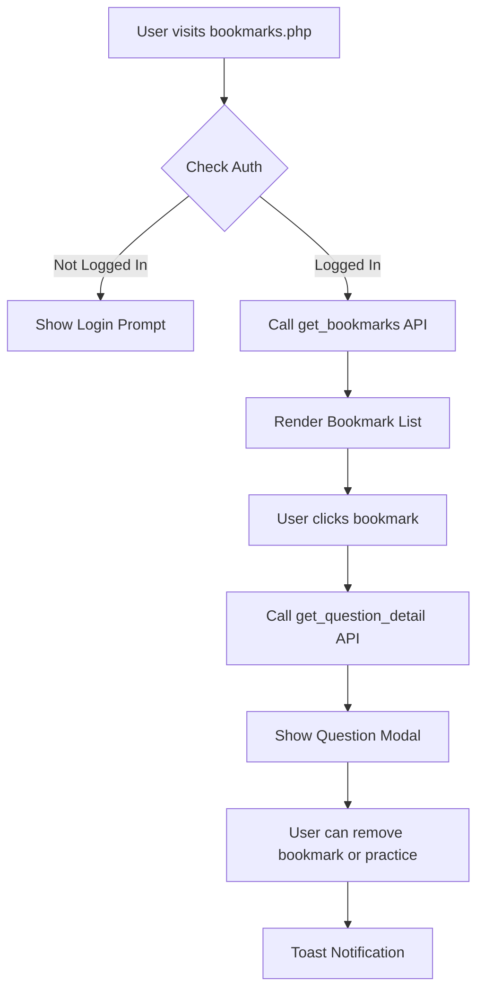

# Bookmarks.php Page - Architectural Plan

## Project Overview
- **Project**: Railway & SSC Quiz App
- **Target Users**: Students preparing for SSC and Railway exams
- **Page Purpose**: Display and manage user's bookmarked questions for quick review

## Current State Analysis

### Existing Components
1. **Database** - [`bookmarks`](database.sql:203) table with `user_id`, `question_id`, `created_at`
2. **API** - [`getBookmarks()`](api.php:455) and [`toggleBookmark()`](api.php:406) functions implemented
3. **Frontend** - [`initBookmarksPage()`](script.js:1414) partially implemented
4. **CSS** - Bookmark styles exist in [`style.css`](style.css:380)
5. **Page Structure** - Basic HTML in [`bookmarks.php`](bookmarks.php:1) with modal

### Identified Gaps
1. `showQuestionDetail()` function is referenced but **NOT IMPLEMENTED**
2. No bookmark removal capability from the list view
3. No filtering by exam type or topic
4. No sorting options (date, topic, difficulty)
5. Question modal lacks complete rendering logic
6. Missing authentication check UI/UX

---

## Functional Requirements

### 1. Display Bookmarks List
- Load bookmarks from API on page load
- Show loading spinner during fetch
- Display "empty state" message when no bookmarks
- Show question preview (truncated to 100 chars)
- Display metadata: topic, exam type, bookmark date
- Add difficulty badges

### 2. Question Detail Modal
- Implement `showQuestionDetail(questionId)` function
- Fetch full question data from API
- Display all 4 options with correct answer highlighting
- Show explanation after user interaction
- Include bookmark toggle button in modal

### 3. Bookmark Management
- Remove bookmark directly from list (with confirmation)
- Remove bookmark from modal view
- Toast notifications for actions

### 4. Filtering & Sorting
- Filter by exam type (CGL, CHSL, MTS, CPO, GD, NTPC, Group D)
- Filter by topic
- Sort by: Date (newest/oldest), Topic, Exam Type
- Search within bookmarks

### 5. Authentication Handling
- Check login status on page load
- Redirect to login or show login prompt if not authenticated
- Display user-specific content when logged in

---

## Technical Implementation Plan

### Phase 1: Backend/API Enhancements
- [ ] Extend `getBookmarks` API to include full question details (options, correct answer)
- [ ] Add API endpoint for single question fetch (`get_question_detail`)
- [ ] Add API endpoint for removing bookmark

### Phase 2: Frontend JavaScript (script.js)
- [ ] Implement `showQuestionDetail(questionId)` function
- [ ] Implement `removeBookmark(questionId)` function
- [ ] Add filtering functionality
- [ ] Add sorting functionality
- [ ] Add search functionality
- [ ] Add toast notification system

### Phase 3: Page UI (bookmarks.php + style.css)
- [ ] Add filter controls (dropdowns, search input)
- [ ] Add sort controls
- [ ] Enhance modal markup and styling
- [ ] Add empty state illustrations
- [ ] Add loading/error states

### Phase 4: Authentication Integration
- [ ] Add login check on page load
- [ ] Handle NOT_LOGGED_IN error code
- [ ] Show appropriate UI for authenticated vs anonymous users

---

## Data Flow

---

## API Endpoints Required

### Existing (Already Implemented)
- `GET api.php?action=get_bookmarks` - Returns bookmark list
- `POST api.php?action=toggle_book - Toggle bookmark statusmark`

### New Endpoints Needed
1. `GET api.php?action=get_question_detail&id={question_id}` - Get full question data
2. `POST api.php?action=remove_bookmark` - Remove a bookmark

---

## UI Components

### Filter Bar
- Exam Type dropdown (All, CGL, CHSL, MTS, CPO, GD, NTPC, Group D)
- Topic dropdown (dynamically populated)
- Sort dropdown (Newest, Oldest, Topic, Exam Type)
- Search input

### Bookmark Card
- Question preview (truncated)
- Exam type badge
- Topic badge
- Difficulty badge (easy/medium/hard)
- Date bookmarked
- Remove button (trash icon)

### Question Modal
- Full question text
- Four options (A, B, C, D)
- Correct answer highlight
- Explanation section
- Bookmark toggle button
- Close button

---

## File Changes Summary

| File | Changes |
|------|---------|
| [`api.php`](api.php) | Add `get_question_detail`, update `get_bookmarks` response |
| [`bookmarks.php`](bookmarks.php) | Add filter bar, enhance modal, improve structure |
| [`script.js`](script.js) | Implement `showQuestionDetail`, filtering, sorting |
| [`style.css`](style.css) | Add filter bar styles, modal enhancements |

---

## Next Steps for Implementation

1. **Start with API** - Add new endpoints in api.php
2. **Update JavaScript** - Implement the missing functions in script.js
3. **Enhance PHP page** - Add filtering UI to bookmarks.php
4. **Polish CSS** - Add necessary styles for new components

The implementation should follow the existing patterns in the project (see [`history.php`](history.php) and [`progress.php`](progress.php) for reference).
