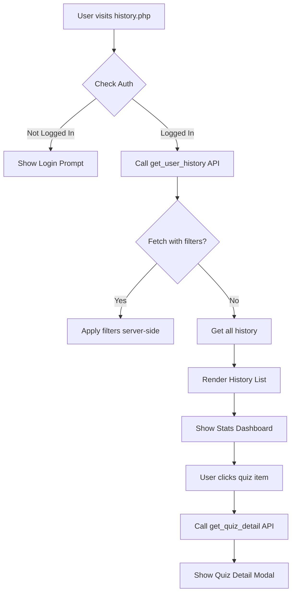

# History.php Page - Architectural Plan

## Project Overview
- **Project**: Railway & SSC Quiz App
- **Target Users**: Students preparing for SSC and Railway exams
- **Page Purpose**: Display and manage user's quiz history with performance analytics

## Current State Analysis

### Existing Components
1. **Database** - [`user_quiz_history`](database.sql:214) table with quiz attempt records
2. **API** - [`getUserHistory()`](api.php:588) function retrieves user's quiz history
3. **API** - [`getPerformanceAnalytics()`](api.php:636) function for topic-wise performance
4. **Frontend** - [`initHistoryPage()`](script.js:1865) initializes the page
5. **Frontend** - [`renderHistoryList()`](script.js:1294) renders history items
6. **Page Structure** - Basic HTML in [`history.php`](history.php:1)
7. **Stats** - Shows Total Attempts, Avg Score, Best Score

### Available Data Fields
From `user_quiz_history` table:
- `id` - Unique quiz attempt ID
- `user_id` - User who took the quiz
- `session_id` - Session identifier
- `exam_type` - CGL, CHSL, MTS, CPO, GD, NTPC_Graduate, NTPC_UG, Group_D
- `section` - SSC or Railway
- `topic` - Topic name (Number System, Percentage, etc.)
- `total_questions` - Total questions in quiz
- `correct_answers` - Correct answers count
- `wrong_answers` - Wrong answers count
- `skipped_answers` - Skipped questions count
- `time_taken` - Time taken in seconds
- `score` - Percentage score
- `practice_mode` - Boolean for practice mode
- `created_at` - Quiz attempt timestamp

### Identified Gaps
1. No filter by exam type, topic, or date range
2. No sorting options (newest/oldest/score)
3. No search functionality within history
4. Auth handling is basic - needs better UX for non-logged-in users
5. No detailed quiz result view (modal with answers)
6. Limited statistics - no accuracy rate, time trends
7. No practice mode vs quiz mode distinction in display

---

## Functional Requirements

### 1. Display Quiz History
- Load history from API using logged-in user session
- Show quiz attempts with exam type, topic, score, date
- Display correct/wrong/skipped counts
- Show time taken for each quiz
- Distinguish between practice mode and quiz mode

### 2. Statistics Dashboard
- Total quizzes taken
- Average score percentage
- Best score achieved
- Total questions answered
- Overall accuracy rate
- Time spent practicing
- Quizzes this week/month

### 3. Filtering & Sorting
- Filter by exam type (CGL, CHSL, etc.)
- Filter by section (SSC/Railway)
- Filter by topic
- Filter by date range (Today, This Week, This Month, All Time)
- Filter by score range (Passed, Failed, High Score)
- Sort by date (newest/oldest)
- Sort by score (highest/lowest)

### 4. Quiz Detail View
- Modal showing full quiz details
- Review questions with correct answers
- Show explanations for wrong answers

### 5. Authentication Handling
- Check login status on page load
- Show login prompt for non-authenticated users
- Display user-specific data only

---

## Technical Implementation Plan

### Phase 1: API Enhancements
- [ ] Add filtering parameters to `getUserHistory` API (exam_type, topic, section, date_from, date_to, sort_by)
- [ ] Add quiz detail endpoint (`get_quiz_detail`) to retrieve specific quiz attempt with questions
- [ ] Add more comprehensive stats endpoint

### Phase 2: Page UI (history.php)
- [ ] Add filter bar (exam type, topic, section, date filter)
- [ ] Add sort controls
- [ ] Enhance stats cards with more metrics
- [ ] Add auth required message
- [ ] Add quiz detail modal

### Phase 3: Frontend JavaScript (script.js)
- [ ] Update `initHistoryPage()` with filter/sort support
- [ ] Update `renderHistoryList()` with enhanced display
- [ ] Implement filter/sort event handlers
- [ ] Add `showQuizDetail()` function for modal
- [ ] Add `loadQuizDetail()` API call

### Phase 4: CSS Styling
- [ ] Add filter bar styles
- [ ] Enhance history item cards
- [ ] Add quiz detail modal styles
- [ ] Add responsive design

---

## Data Flow

---

## API Endpoints

### Existing (Already Implemented)
- `GET api.php?action=get_user_history&limit=50` - Returns user's quiz history with stats

### New Endpoints Needed
1. `GET api.php?action=get_user_history` with filters:
   - `exam_type` - Filter by exam
   - `section` - Filter by section (SSC/Railway)
   - `topic` - Filter by topic
   - `date_from` - Start date
   - `date_to` - End date
   - `sort_by` - newest, oldest, score_high, score_low
   - `limit` - Pagination

2. `GET api.php?action=get_quiz_detail&id={quiz_id}` - Get full quiz details with questions

---

## UI Components

### Filter Bar
- Section toggle (All, SSC, Railway)
- Exam Type dropdown
- Topic dropdown
- Date range selector (This Week, This Month, All Time)
- Sort dropdown

### Stats Cards
- Total Quizzes
- Average Score
- Best Score
- Total Questions
- Accuracy Rate
- Time Practiced

### History Item Card
- Exam type badge with color
- Section badge (SSC/Railway)
- Topic name
- Score with color coding (green >=60%, red <60%)
- Question stats (correct/wrong/skipped)
- Time taken
- Date/time
- Practice/Quiz mode indicator

### Quiz Detail Modal
- Quiz summary (exam, topic, score)
- Questions list with user answers
- Correct answers highlighted
- Explanations for wrong answers
- Time taken

---

## File Changes Summary

| File | Changes |
|------|---------|
| [`api.php`](api.php) | Enhance `getUserHistory` with filters, add `getQuizDetail` endpoint |
| [`history.php`](history.php) | Add filter bar, enhance stats, add modal |
| [`script.js`](script.js) | Update initHistoryPage, add filtering, add quiz detail modal |
| [`style.css`](style.css) | Add filter bar styles, history item enhancements |

---

## Next Steps for Implementation

1. **Start with API** - Enhance getUserHistory with filtering and sorting
2. **Update PHP page** - Add filter UI components
3. **Update JavaScript** - Implement filter/sort logic and modal
4. **Add CSS** - Style the new components

The implementation should follow the patterns established in bookmarks.php for consistency.
