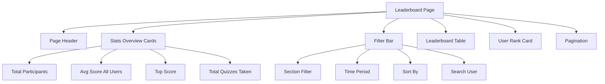

# Leaderboard.php Architecture Plan

## Project Overview
Railway & SSC Quiz App - Leaderboard page for displaying top performers across quizzes.

---

## Current State Analysis

### Existing Implementation
- **PHP Page**: Basic HTML structure with tabs (Overall, SSC, Railway)
- **API**: `get_leaderboard` function in `api.php` - returns top users by average score (min 3 quizzes)
- **Frontend JS**: `initLeaderboardPage` and `loadLeaderboardData` in `script.js`

### Identified Issues
1. **Tabs non-functional**: Tabs (Overall/SSC/Railway) exist in HTML but don't filter data by section
2. **No stats overview**: Unlike history.php, no summary cards showing key metrics
3. **No user rank card**: Logged-in users don't see their own rank prominently displayed
4. **Limited filtering**: No time filters, sorting options, or search
5. **Missing fields**: Doesn't display total questions answered, total correct answers, accuracy percentage
6. **No pagination**: Shows fixed 20 results without load more option
7. **Session handling**: API doesn't properly identify logged-in users for rank display

---

## Architecture Components

### 1. Database/API Layer

#### Required API Enhancements
```php
// New action: get_leaderboard_detailed
// Parameters: section (SSC|Railway|all), time_period (all|today|week|month|year), limit, offset
// Returns: leaderboard entries with full stats + user_rank + total_count for pagination
```

#### Database Query Requirements
- Filter by section (SSC/Railway) from `user_quiz_history.section`
- Filter by time period using `created_at`
- Support sorting: avg_score, best_score, quiz_count, accuracy
- Calculate accuracy: (total_correct / total_questions) * 100

---

### 2. Frontend Page Structure (leaderboard.php)

#### Layout Sections


#### Components

| Component | Description | Similar To |
|-----------|-------------|------------|
| Page Header | Title + description | history.php |
| Stats Overview | 4 summary cards with icons | history.php |
| Filter Bar | Section, time, sort, search | history.php |
| Leaderboard Table | Rank, user, stats, actions | - |
| User Rank Card | Current user's rank (if logged in) | - |
| Pagination | Load more / pagination | - |

---

### 3. Frontend JavaScript (script.js)

#### Functions to Implement/Enhance
1. `initLeaderboardPage()` - Initialize page, setup tabs, filters
2. `loadLeaderboardData(type)` - Enhanced to accept section filter
3. `renderLeaderboardTable(data)` - Render table with all fields
4. `renderStatsOverview(data)` - Render summary cards
5. `renderUserRankCard(userRank)` - Show logged-in user's rank
6. `setupLeaderboardFilters()` - Event listeners for filters
7. `setupLeaderboardTabs()` - Tab switching logic

#### State Management
```javascript
const leaderboardState = {
    section: 'all',      // all, SSC, Railway
    timePeriod: 'all',   // all, today, week, month, year
    sortBy: 'avg_score', // avg_score, best_score, quiz_count, accuracy
    searchQuery: '',
    currentPage: 1,
    itemsPerPage: 20
};
```

---

### 4. CSS Styling (style.css)

#### New Styles Required
- Leaderboard table styles (existing: leaderboard-item, leaderboard-table)
- Stats cards grid layout
- Filter bar styling
- User rank card with highlight
- Pagination styles
- Responsive adjustments for mobile
- Rank badge colors (gold, silver, bronze)

#### Color Scheme
- Top 1: Gold gradient (#ffd700 → #ffed4e)
- Top 2: Silver gradient (#c0c0c0 → #e8e8e8)
- Top 3: Bronze gradient (#cd7f32 → #e8a85c)
- Current user row: Highlight with accent color

---

## Detailed Feature List

### F1: Section-Based Filtering (Tabs)
- **Overall**: All users across both sections
- **SSC**: Only SSC exam quizzes
- **Railway**: Only Railway exam quizzes
- Implementation: API filters by `section` field in `user_quiz_history`

### F2: Time Period Filtering
- All Time (default)
- Today
- This Week
- This Month
- This Year
- Implementation: SQL WHERE clause on `created_at`

### F3: Sorting Options
- Average Score (default)
- Best Score
- Quiz Count
- Accuracy
- Implementation: ORDER BY clause

### F4: Search Functionality
- Search by username or full_name
- Real-time filtering as user types

### F5: Stats Overview Cards
- Total Participants
- Average Score (all users)
- Top Score
- Total Quizzes Taken

### F6: User Rank Card (Logged-in users)
- Shows current user's rank
- Displays: rank, username, quiz count, avg score, accuracy
- "Not ranked" message if < 3 quizzes

### F7: Leaderboard Table Columns
| Column | Description |
|--------|-------------|
| Rank | Position (1st, 2nd, 3rd with badges) |
| User | Username + Full Name |
| Quizzes | Number of quizzes taken |
| Avg Score | Average score percentage |
| Best Score | Highest score achieved |
| Accuracy | Overall accuracy percentage |
| Actions | View profile (future) |

### F8: Pagination
- Show 20 results per page
- "Load More" button
- Total count display: "Showing X of Y participants"

---

## Implementation Priority

### Phase 1: Core Features (MVP)
1. Fix section filtering (SSC/Railway/Overall tabs)
2. Add time period filtering
3. Enhance leaderboard table with all fields
4. Add sorting options
5. User rank card for logged-in users

### Phase 2: Enhanced UX
1. Stats overview cards
2. Search functionality
3. Pagination
4. Responsive design improvements

### Phase 3: Future Enhancements
1. View other users' profiles
2. Achievement badges
3. Time-based leaderboards (weekly winners)
4. Export leaderboard (CSV)

---

## File Changes Summary

| File | Changes |
|------|---------|
| `leaderboard.php` | Add stats overview, filter bar, user rank card, pagination container |
| `api.php` | Add/enhance `get_leaderboard` with section, time_period, sort parameters |
| `script.js` | Add new functions for enhanced leaderboard, state management |
| `style.css` | Add new styles for cards, filters, table enhancements |

---

## Acceptance Criteria

1. ✅ Tabs correctly filter leaderboard by section (SSC/Railway/Overall)
2. ✅ Time period filter works correctly
3. ✅ Sort options change table order
4. ✅ Logged-in users see their rank prominently
5. ✅ Table shows all required columns with correct data
6. ✅ Stats cards display aggregate information
7. ✅ Search filters results in real-time
8. ✅ Pagination works correctly
9. ✅ Responsive design works on mobile
10. ✅ Empty states handled gracefully
